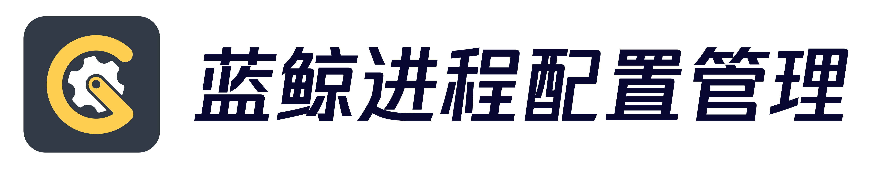

---
[](https://github.com/Tencent/bk-process-config-manager/blob/master/LICENSE)
[](https://github.com/Tencent/bk-process-config-manager/releases)
[](https://travis-ci.com/Tencent/bk-process-config-manager)
[](https://codecov.io/gh/Tencent/bk-process-config-manager)
[](https://github.com/Tencent/bk-process-config-manager/pulls)

[(English Documents Available)](readme_en.md)

蓝鲸进程配置管理


## Overview
蓝鲸进程配置管理

## Features
了解更多功能，请参考[GSEKIT白皮书](http://docs.bk.tencent.com/product_white_paper/gsekit/)


## Getting started
#### 后台
- 安装好`MySQL 5.7`、`Python3.7`，若同时开发多个项目，请创建Python虚拟环境
- 创建数据库 `CREATE DATABASE bk_gsekit DEFAULT CHARACTER SET utf8 COLLATE utf8_general_ci;`
- 在项目根目录下新建`local_settings.py`文件，文件内容为数据库配置，如
```python
DATABASES = {
    'default': {
        'ENGINE': 'django.db.backends.mysql',
        'NAME': 'bk_gsekit',
        'USER': 'root',
        'PASSWORD': '',
        'HOST': '127.0.0.1',
        'PORT': '3306',
    },
}
```
- 配置环境变量 `APP_ID=${APP_ID};BK_IAM_V3_INNER_HOST=${BK_IAM_V3_INNER_HOST};BK_PAAS_HOST=${BK_PAAS_HOST};APP_TOKEN=${APP_TOKEN}`
- 启动工程 `python manage.py runserver 8000`
- 启动celery `celery -A blueapps.core.celery worker -l info -c 8`

## Version plan
- [版本日志](docs/release.md)


## Support
- [源码](https://github.com/Tencent/bk-process-config-manager/tree/master)
- [wiki](https://github.com/Tencent/bk-process-config-manager/wiki)
- [白皮书](http://docs.bk.tencent.com/product_white_paper/bk-process-config-manager/)
- [蓝鲸论坛](https://bk.tencent.com/s-mart/community)
- [蓝鲸 DevOps 在线视频教程](https://cloud.tencent.com/developer/edu/major-100008)
- 联系我们，加入腾讯蓝鲸运维开发交流群：878501914

## BlueKing Community
* [BK-CMDB](https://github.com/Tencent/bk-cmdb)：蓝鲸配置平台（蓝鲸 CMDB）是一个面向资产及应用的企业级配置管理平台。
- [BK-CI](https://github.com/Tencent/bk-ci)：蓝鲸持续集成平台是一个开源的持续集成和持续交付系统，可以轻松将你的研发流程呈现到你面前。
- [BK-BCS](https://github.com/Tencent/bk-bcs)：蓝鲸容器管理平台是以容器技术为基础，为微服务业务提供编排管理的基础服务平台。
- [BK-BCS-SaaS](https://github.com/Tencent/bk-bcs-saas)：蓝鲸容器管理平台 SaaS 基于原生 Kubernetes 和 Mesos 自研的两种模式，提供给用户高度可扩展、灵活易用的容器产品服务。
- [BK-PaaS](https://github.com/Tencent/bk-PaaS)：蓝鲸 PaaS 平台是一个开放式的开发平台，让开发者可以方便快捷地创建、开发、部署和管理 SaaS 应用。
- [BK-SOPS](https://github.com/Tencent/bk-sops)：标准运维（SOPS）是通过可视化的图形界面进行任务流程编排和执行的系统，是蓝鲸体系中一款轻量级的调度编排类 SaaS 产品。
- [BK-BASE](https://github.com/Tencent/bk-base)：蓝鲸基础计算平台(BK-BASE)是一个专注于运维领域的的基础平台，打造一站式、低门槛的基础服务。通过简化运维数据的收集、获取，提升数据开发效率，辅助运维人员实时运维决策，助力企业运营体系数字化、智能化转型。


## Contributing
如果你有好的意见或建议，欢迎给我们提 Issues 或 Pull Requests，为蓝鲸开源社区贡献力量。关于 GSEKIT 分支管理、Issue 以及 PR 规范，
请阅读 [Contributing Guide](docs/CONTRIBUTING.md)。

[腾讯开源激励计划](https://opensource.tencent.com/contribution) 鼓励开发者的参与和贡献，期待你的加入。

## License
GSEKIT 是基于 MIT 协议， 详细请参考 [LICENSE](LICENSE.txt) 。