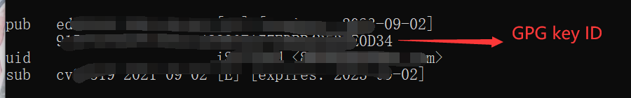
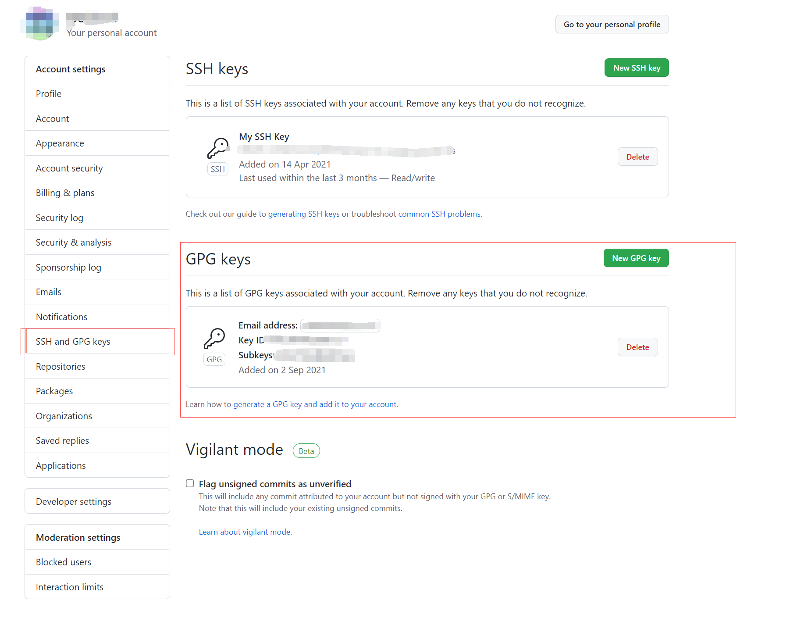
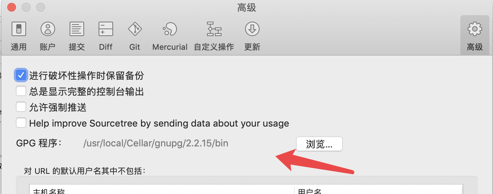
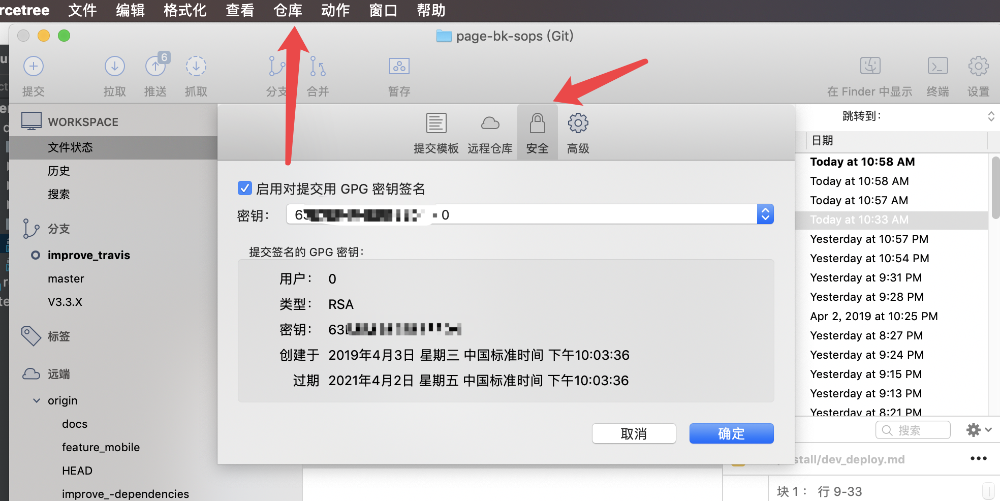

## 敏感信息配置

### 1. 本地敏感信息检查

在开源开发中，我们需要过滤掉相应的敏感信息，否则敏感信息一旦提交到 github，就基本不可能完全去掉包含敏感信息的提交记录和副本，所以必须在提交前检查。

#### Git Hooks 本地配置

1. 使用pip安装pre-commit

	```shell
	# pip
	pip install pre-commit
	```

2. 在有.git的项目配置pre-commit

	```shell
	pre-commit install
	```

执行后，查看 `.git/hooks` 目录，若存在名为 `pre-commit` 新文件，则配置成功 。

>pre-commit 代码检查无需手动触发，只要执行 `git commit` 命令，就会自动触发（无论是在终端还是IDE）。请注意，代码检查的范围只是本次提交所修改的文件，而非全局。

#### 敏感文件配置

在开发者下载附件中的 git-pre-commit-check.tar.gz 包，然后解压后把 **ips、rtx、pre-commit** 添加到本地项目下的 .git/hooks/ 目录下即可。


### 2.GPG配置

[GPG](https://help.github.com/articles/managing-commit-signature-verification/)是一种加密算法，现在github支持commit使用GPG加密，从而保证提交的commit在传输的过程中没有被篡改。

#### GPG安装

- https://www.gnupg.org/download/
- mac: https://gpgtools.org/ 或者 brew install GPG

#### 生成GPG key

在安装的bin目录下执行`gpg --gen-key`生成密钥，然后执行`gpg --list-keys`可以查看

>注意 sub 是私钥，pub 是 公钥，一串数字和字母的是GPG key ID



执行`gpg --armor --export pub {GPG_key_ID}`可以直接获取公匙。

#### github 设置 GPG key

拷贝上面得到的公钥到 GitHub 账号中，注意格式开头：-----BEGIN PGP PUBLIC KEY BLOCK-----，结尾：-----END PGP PUBLIC KEY BLOCK-----。



```shell
# 当前仓库开启
git config --local user.signingkey {GPG_key_ID}
# 开启
git config commit.gpgsign true
# 关闭
git config commit.gpgsign false

# 或者本地所有仓库开启 -> 推荐
git config --global user.name "xxx"
git config --global user.email "xxx"
git config --global user.signingkey {GPG_key_ID}
git config --global commit.gpgsign true
```

配置完成后提交代码后能看到 Verified 字样。

如果你在执行`git commmit`时报错

```shell
error: gpg failed to sign the data
fatal: failed to write commit object
```

请尝试执行`gpgconf –kill gpg-agent`重启 gpg-agent，或者在 ~/.bash_profile 中加入`export GPG_TTY=$(tty)`后执行 source。

如果在windows系统下执行`git commmit`时报错

```shell
gpg: skipped "CA478916*******************": secret key not available
gpg: signing failed: secret key not available
error: gpg failed to sign the data
fatal: failed to write commit object
```

可尝试设置gpg程序路径：

```shell
git config --global gpg.program "xxx\bin\gpg.exe"
```

#### 在 sourcetree 客户端配置 GPG

由于 sourcetree 只能识别支持客户端的 gpg2，所以必须先新建一个 gpg2 的软连接。

```
cd /usr/local/Cellar/gnupg/2.2.15/bin/
ln -s gpg gpg2
```

然后在 sourcetree 偏好设置中的高级选项选择 GPG 程序路径，注意隐藏路径可以使用 command+shift+G 打开。



最后在仓库设置中的安全选项中打开 GPG 设置，注意，首次提交会报错，请先在命令行提交并输入 GPG 账户的密码，后面就可以使用 sourcetree 提交代码了。

